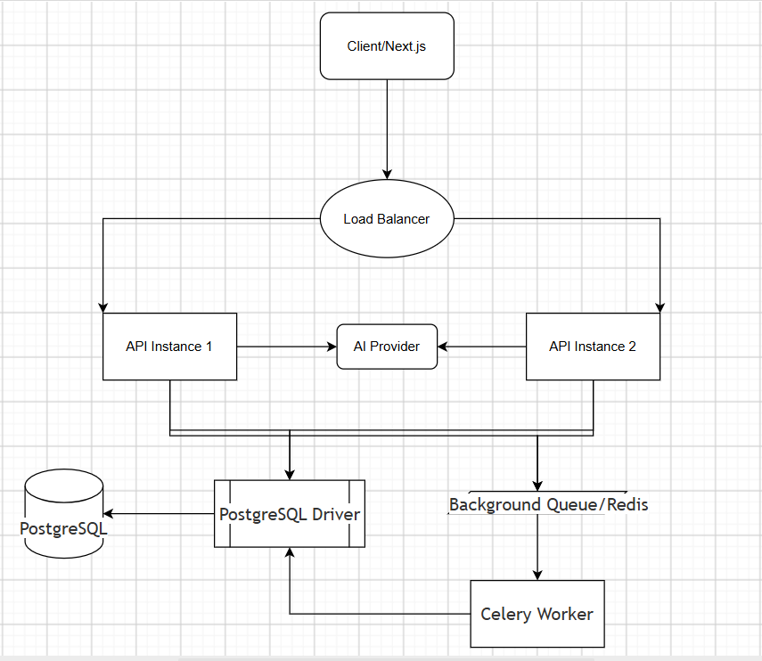

# CrewLink Member Callout

## Part 0 (Requirements)

### What we're building

CrewLink will allow union leadership to create and send announcements to active members of their own local and optionally filtered by work classification. Members can read and acknowledge announcements or callouts, while leadership can monitor sent, read, and acknowledged counts (within thier own local).

The system must enforce strict local and role isolation and must prevent duplicate delivery when requests are retried or workers restart.

### Assumptions

1. Only active members receive announcements.
2. Leadership can target an entire local or one work classification.
3. Acknowledgement is optional and controlled by `needs_ack`.
4. "Sent" means the system has recorded the recipient delivery successfully; real push integration is outside this exercise.
5.  Sending is asynchronous, so leadership does not wait for all recipients.
6. AI output is always a draft requiring human approval.

### Concern

The possible exposure of one local's member contact information to another local is a serious privacy/security concern. Authorization must therefore be enforced server-side, not only in the UI.

### Questions

1. Should leadership be able to select multiple classifications?
   **Assumption:** one classification for this slice.

2. Which announcements require acknowledgement?
   **Assumption:** `needs_ack` determines this.

3. Which notification channels are required?
   **Assumption:** delivery is logged/stored; real push is future work.

---

# Part A (Design)

## 1. Data Model

The main entities are:

**Local**

`id`, `name`

**User**

`id`, `email`, `password_hash`
`role`  (`LEADERSHIP | MEMBER`)
`local_id`

**Member**

`id`, `local_id`, `user_id`
`full_name`, `email`, `classification`
`status` (`active | retired | suspended`)

**Announcement**

`id`, `local_id`, `created_by`
`title`, `body`, `push_preview`
`needs_ack`
`status` (`draft | queued | sending | sent`)
`sent_at`, `created_at`

**AnnouncementRecipient**

`id`, `announcement_id`, `member_id`
`delivery_status`  (`pending | sent`)
`sent_at`, `read_at`, `acknowledged_at`

`AnnouncementRecipient` has a unique constraint on `(announcement_id, member_id)`. This records the state of every recipient and prevents duplicate recipient rows.

RSVP (`coming` / `can't`) is represented in the design as a future extension but is not implemented in the build.

## 2. Send Path

When leadership presses Send:

1. Django authenticates the user and verifies leadership permission.
2. The API verifies that the selected local belongs to that user.
3. The announcement is created and validated.
4. Recipient records are created for matching active members.
5. The transaction commits and a background job is queued.
6. The API immediately returns a queued response; it does not wait for all recipients.
7. A worker processes pending recipients in batches.
8. Each successful delivery updates its `AnnouncementRecipient` record.
9. The leadership dashboard reads aggregate sent/read/acknowledged counts.

The initial implementation can use polling every few seconds for dashboard counts rather than querying every second. A production version could use SSE/WebSockets.

If a worker crashes, processing resumes from persistent recipient state. Real push notifications are not required by the exercise, so delivery can be represented by a database/log record.

## 3. The Two Rules, By Design

### Rule 1: Data and role isolation

`local_id` is the tenant boundary. Every local-owned query is scoped to the authenticated user's local. A user from Local A therefore cannot retrieve Local B announcements, members, or other local data.

Role permissions are enforced in the backend. Leadership-only endpoints require `LEADERSHIP`; members cannot send announcements even if they manually call the API.

The frontend only controls presentation and is not treated as a security boundary.

Reusable DRF permission classes and local-scoped querysets/services make the security model consistent across endpoints. Tests will cover cross-local access and member access to leadership operations.

Production monitoring should record authorization failures, cross-local access attempts, and unexpected permission errors.

### Rule 2: No duplicate delivery

The database is the source of truth; no in-memory set is used.

Each delivery is identified by:

`(announcement_id, member_id)`

The unique constraint prevents duplicate recipient records. Workers process persistent recipient records and skip recipients already marked as sent. Transactions/row locking prevent concurrent workers from processing the same recipient simultaneously.

Therefore a retry or worker restart finds the same recipient record and does not create another delivery.

This also works with multiple Django instances because the idempotency state is stored in shared PostgreSQL rather than process memory.

In production, duplicate attempts, stuck deliveries, and unusual delivery failures would be monitored and alerted. If a real external push provider is introduced, provider-supported idempotency keys or an outbox pattern would be needed to handle the failure window between provider acceptance and database update.

## 4. Architecture Diagram

AI is used only to generate a draft title, body, and ≤120-character push preview. The generated content must be reviewed and approved by leadership before it can be sent. If the AI provider is unavailable, leadership can still create an announcement manually.

---

# What I Cut / Next Steps

The build will not include real push-provider integration, a member UI, RSVP, production deployment, or advanced real-time monitoring. These can be added later. The optional two-instance/load-balancer setup will only be added if the required slice and tests are already solid.